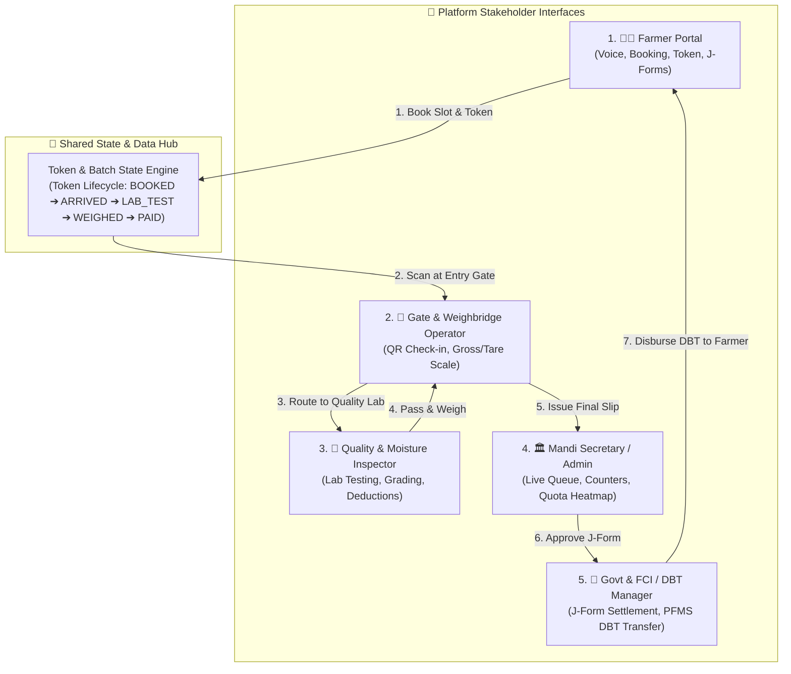

# 🏛️ AgriQueue: Complete Multi-Stakeholder System Architecture (SIH26032)

> **Document Version**: 2.0  
> **Target Audience**: Development Team, Hackathon Teammates, UI/UX Designers, Backend Engineers  
> **Problem Statement**: Smart Farmer Crop Procurement & Mandi Queue Management (SIH26032)

---

## 1. System Vision & Stakeholder Ecosystem

AgriQueue is an end-to-end intelligent crop procurement, queue optimization, and transparent MSP distribution ecosystem. To build a complete multi-portal application, the system is divided into **5 core stakeholder interfaces**:



---

## 2. Token Lifecycle & State Machine

Every procurement transaction follows a deterministic finite-state machine across all 5 interfaces:

```text
[ BOOKED / SCHEDULED ]   ➔ Created on Farmer Portal
          │
          ▼ (Gate In QR Scan)
[ ARRIVED / CHECKED_IN ] ➔ Recorded by Gate Operator (Lane Assigned)
          │
          ▼ (Moisture & Impurity Lab Check)
[ QUALITY_INSPECTED ]    ➔ Moisture ≤ FCI Norms (Passed / Deducted)
          │
          ▼ (Electronic Weighbridge Gross - Tare)
[ WEIGHMENT_COMPLETED ]  ➔ Net Crop Quantity Certified
          │
          ▼ (Mandi Officer Review)
[ J_FORM_ISSUED ]        ➔ Legally binding procurement receipt generated
          │
          ▼ (PFMS / Bank Integration)
[ DBT_DISBURSED ]        ➔ 100% MSP credited to Farmer's Account
```

---

## 3. Module Specifications for Teammates

### 🧑‍🌾 Module 1: Farmer Portal (`farmer_dashboard.html`) - *[Completed]*
* **Role**: Enable farmers to schedule slots, find nearest mandis, and track wait times.
* **Key Features**:
  - Full Multilingual UI (9 Indian languages: `hi`, `te`, `ta`, `pa`, `mr`, `kn`, `bn`, `gu`, `en`).
  - Voice-guided form filling (Offline MP3 voice packs + Web Speech fallback).
  - Geolocation proximity discovery of nearest verified Mandis.
  - Digital Token Generation (`TK-XXXX`) & J-Form / MSP DBT ledger.

---

### 🚪 Module 2: Gate & Weighbridge Operator Interface (`gate_operator.html`) - *[Completed]*
* **Role**: Physical intake control at the Mandi entrance and weighbridge station.
* **Key Features (Built)**:
  - **Token / QR Scanner**: Look up a token by token number, vehicle plate, farmer name or mobile, plus a simulated camera scan (no camera/QR library). Bookings made on the Farmer Portal appear here as *Scheduled*.
  - **Vehicle Entry**: The plate is the one the farmer typed at booking (saved with the booking; the gate asks for it only on older bookings that lack one). The operator picks the entry gate and the weighbridge scale; the scale defaults to the least-loaded **open** lane, and lanes closed in Module 4 are disabled.
  - **Gross Weight Capture**: Simulated electronic weighbridge reading (or manual entry) in Qtl; saved as the 1st weighment, so the trolley can be unloaded before the 2nd.
  - **Tare Weight Capture**: Second weighing after unloading. Net = Gross − Tare, with a variance check against the booked quantity.
  - **Quality Gate**: Weighing is blocked until Module 3 has passed the lot; a rejected lot can never be weighed. The Grade B moisture deduction from Module 3 flows into the slip and the farmer's payout.
  - **Status Trigger**: Transitions token from `BOOKED` $\rightarrow$ `ARRIVED` $\rightarrow$ `WEIGHMENT_COMPLETED`. Check-in adds the trolley to the Module 3 queue and moves the farmer's timeline to *Gate* (step 2); completing the weighment sets *Weight* (step 4) and the certified quantity/total. J-Form and DBT stages belong to later modules. Prints an Electronic Weighment Slip.
  - **Data**: The page is a view over `AgriQueueStore` (see Shared Storage Keys); it keeps no private records.

---

### 🔬 Module 3: Quality Lab & Moisture Testing Dashboard (`quality_inspector.html`) - *[Completed]*
* **Role**: Digital moisture analysis and quality certification according to FCI standards.
* **Key Features (Built)**:
  - **Inspection Queue**: Auto-populated list of arrived farmers waiting for testing.
  - **Moisture Analyzer Input**: Enter moisture % (e.g., Paddy Grade-A: $\le 14.0\%$, Wheat: $\le 12.0\%$).
  - **Impurity / Foreign Matter Rating**: Check for chaff, damaged grains, or mud (Standard: $\le 1.0\%$).
  - **Automated Grade Decision**:
    - **Grade A (Full MSP)**: Moisture within limit.
    - **Grade B / Minor Moisture**: Value deduction percentage calculation.
    - **Rejected (Exceeds Max Safe Storage)**: Audio/SMS alert with drying instructions.
  - **Status Trigger**: Transitions token from `ARRIVED` $\rightarrow$ `QUALITY_INSPECTED`.

---

### 🏛️ Module 4: Mandi Secretary & District Admin Portal (`admin_dashboard.html`) - *[Completed]*
* **Role**: Real-time crowd management, bottleneck prevention, and procurement target tracking.
* **Key Features (Built)**:
  - **Live Mandi Heatmap**: Per-station tiles (Gate, Moisture Lab, Weighbridge) showing trolleys in queue, open counters, utilisation and predicted wait, plus KPI cards for trolleys in yard, end-to-end wait, gate throughput and procurement progress. Hub switcher for all 6 centres and a district roll-up table.
  - **Dynamic Counter Management**: Open/close moisture counters and weighbridge lanes (a station's last open counter cannot be closed). Changes recompute waits immediately and are honoured by the gate's lane assignment.
  - **Procurement Quotas vs Actuals**: Per-crop daily target (share of the centre's capacity) against Qtl weighed today, with quality-passed-but-unweighed quantity shown separately.
  - **Congestion Alert System**: Predictive warning from an M/M/c (Erlang-C) queue model (`queue_engine.js`) fed by measured arrival rate and open counters. Amber at ≥ 30 min, red at ≥ 45 min, with a what-if recommendation ("open Lab Counter 3: 56 → 32 min") and a persisted alert/action log. A *Simulate Arrival Surge* tool demonstrates it.

---

### 🏦 Module 5: FCI & Government DBT Settlement Portal (`dbt_portal.html`) - *[Completed]*
* **Role**: Transparency auditor, J-Form verification, and banking disburse engine.
* **Key Features (Built)**:
  - **Batch J-Form Approvals**: The officer ticks certified procurements (weighed by Module 2, quality-passed by Module 3) and approves them in one batch. Each one is checked first: weighment certified, quality passed, Aadhaar-linked bank account on file, not on hold (blocking), and net weight within ±10% of the booked quantity (warning). Failures are skipped with the reason while the rest of the batch goes through. Approved amounts are frozen on the J-Form (net weight × rate after any Grade B moisture deduction). Procurements can be placed on hold with a reason and released later.
  - **DBT Banking Engine (PFMS Mock)**: "Disburse via PFMS" dispatches the frozen J-Form amount to each farmer's bank account in one PFMS batch (`PFMS-B-yyyymmdd-nnn`) with a generated UTR (`SBIN` / `PUNB` / … + date + 4 digits).
  - **Farmer Payment Status Tracking**: Dispatched $\rightarrow$ In Transit $\rightarrow$ Settled, advancing automatically (15 s / 40 s in this demo, with a live progress bar and a *Fast-forward bank* button). The farmer's record follows: J-Form issued and dispatched keep the timeline at *Weight* (step 4); only *Settled* ticks *DBT Paid* (step 5) and shows the UTR.
  - **Audit Logs & Export**: Every approval, hold, release, dispatch, transit, settlement and export is logged with the acting officer. The procurement register exports as **CSV** (UTF-8 with BOM, opens in Excel; follows the list filter) or as a print-ready register for **PDF** (browser *Save as PDF*). J-Forms open as a printable document.
  - **Token states**: extends the state machine to `WEIGHMENT_COMPLETED` $\rightarrow$ `J_FORM_ISSUED` $\rightarrow$ `DBT_DISBURSED` (settled). The PFMS and bank integration is simulated.

---

## 4. Shared Data Models & JSON Schemas

Teammates building other dashboards should read and write data using this standardized JSON schema:

### A. Queue Token Object (`kisan_procurement_batches` / `TokenSchema`)
```json
{
  "tokenId": "TK-1042",
  "farmerId": "FAR-2026-8812",
  "farmerName": "Ramesh Chand",
  "farmerMobile": "9876543212",
  "cropKey": "paddy_a",
  "cropName": "Paddy (Grade A)",
  "estimatedQty": 50,
  "hubId": "PC-101",
  "hubName": "Karnal Central Procurement Hub",
  "slotTime": "09:00 AM - 10:00 AM",
  "vehicleNo": "HR-05-T-9812",
  "status": "ARRIVED",
  "statusTimeline": {
    "bookedAt": "2026-09-20T08:30:00Z",
    "gateInAt": "2026-09-20T09:12:00Z",
    "labTestedAt": null,
    "weighedAt": null,
    "paidAt": null
  },
  "qualityReport": {
    "moisturePct": 11.8,
    "foreignMatterPct": 0.4,
    "grade": "Grade A",
    "passed": true,
    "inspectorId": "INS-401"
  },
  "weighmentReport": {
    "grossWeightQtl": 58.20,
    "tareWeightQtl": 8.20,
    "netWeightQtl": 50.00,
    "scaleId": "WB-02"
  },
  "financials": {
    "mspPerQtl": 2300,
    "totalAmount": 115000,
    "dbtStatus": "PROCESSING",
    "utrNo": "SBIN202609208819",
    "bankAccount": "SBI A/c ...5019"
  }
}
```

---

### B. Shared Storage Keys (browser `localStorage`, no backend yet)

The modules exchange data through `localStorage`; `public/ops_store.js` (`window.AgriQueueStore`) is the shared adapter used by Modules 2 and 4 and by Module 3's write-back to the farmer records. `AgriQueueStore.getTokens()` returns one merged view shaped like the `TokenSchema` above, with `status` derived from the Section 2 state machine, `BOOKED` → … → `WEIGHMENT_COMPLETED` → `J_FORM_ISSUED` → `DBT_DISBURSED` (from gate entries, the QC result and the DBT ledger, not from the farmer record's numeric `step`).

| Key | Owner (writer) | Content |
| :--- | :--- | :--- |
| `kisan_procurement_batches` | Farmer portal; updated by Modules 2 and 3 | Booking records (`token`, `crop`, `qty`, `rate`, `total`, `step`, `status`…). Steps: 1 Slot, 2 Gate, 3 Moisture, 4 Weight, 5 DBT |
| `agriqueue_qc_samples` | Module 3; gate check-ins are appended by Module 2 | Lab queue and results (`PENDING`, `PASSED_GRADE_A`, `PASSED_DEDUCTION`, `REJECTED`) |
| `agriqueue_gate_state` | Module 2 (through `AgriQueueStore`) | Gate entries (vehicle, entry gate, weighbridge lane, gross/tare/net with timestamps), expected arrivals, simulated trolleys |
| `agriqueue_admin_state` | Module 4 | Counter open/close state per centre, alert/action log |
| `agriqueue_dbt_state` | Module 5 (through `AgriQueueStore`) | J-Forms (frozen amounts), holds, PFMS payments (UTR, batch, dispatch/transit/settle times), PFMS batches, audit log |

`queue_engine.js` is a pure Erlang-C (M/M/c) helper (`erlangC`, `estimateWait`, `whatIfExtraCounter`) that can also drive the farmer portal's ETA later.

---

## 5. Unified Design System Guidelines for Teammates

All new dashboards and pages **must** adhere to the AgriQueue design tokens defined in [`farmer.css`](file:///c:/Users/dines/OneDrive/Desktop/Pushkaran%20Projects/College%20Projects/SIH/public/farmer.css):

### Color Palette Tokens
| Variable | Value | Usage |
| :--- | :--- | :--- |
| `--color-primary` | `#137547` (Forest Green) | Main brand headers, primary action buttons, active tabs |
| `--color-primary-dark` | `#0d5232` (Deep Green) | Badges, card titles, emphasis |
| `--color-primary-light`| `#e8f5e9` (Mint Tint) | Card backgrounds, active state fills |
| `--color-secondary` | `#ea580c` (Agri Amber) | Token numbers, urgent queue alerts, warnings |
| `--color-bg-page` | `#f4fbf7` (Clean Off-White) | Dashboard body background |
| `--color-surface` | `#ffffff` (Pure White) | Container cards, tables, modals |
| `--color-border` | `#d1fae5` / `#e2e8f0` | Dividers and card borders |

### Typography
* **Headings & Body**: `'Plus Jakarta Sans'`, sans-serif
* **Numbers, Tokens, Weights & MSP Currency**: `'JetBrains Mono'`, monospace

---

## 6. Development & Deployment Guide

```bash
# 1. Clone repository
git clone https://github.com/24eg105r65-glitch/AgriQueue.git
cd AgriQueue

# 2. Run local development server
python -m http.server 3000 --directory public

# 3. Access the portals
http://localhost:3000/farmer_dashboard.html     # Module 1: Farmer
http://localhost:3000/gate_operator.html        # Module 2: Gate & Weighbridge
http://localhost:3000/quality_inspector.html    # Module 3: Quality Lab
http://localhost:3000/admin_dashboard.html      # Module 4: Mandi Admin
http://localhost:3000/dbt_portal.html           # Module 5: FCI & DBT Settlement
```
