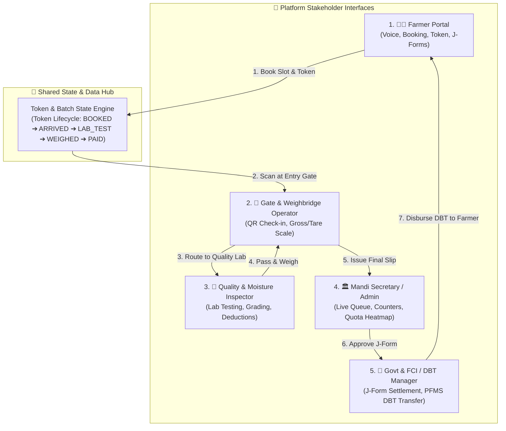

# 🏛️ AgriQueue: Complete Multi-Stakeholder System Architecture (SIH26032)

> **Document Version**: 2.0  
> **Target Audience**: Development Team, Hackathon Teammates, UI/UX Designers, Backend Engineers  
> **Problem Statement**: Smart Farmer Crop Procurement & Mandi Queue Management (SIH26032)

---

## 1. System Vision & Stakeholder Ecosystem

AgriQueue is an end-to-end intelligent crop procurement, queue optimization, and transparent MSP distribution ecosystem. To build a complete multi-portal application, the system is divided into **5 core stakeholder interfaces**:



---

## 2. Token Lifecycle & State Machine

Every procurement transaction follows a deterministic finite-state machine across all 5 interfaces:

```text
[ BOOKED / SCHEDULED ]   ➔ Created on Farmer Portal
          │
          ▼ (Gate In QR Scan)
[ ARRIVED / CHECKED_IN ] ➔ Recorded by Gate Operator (Lane Assigned)
          │
          ▼ (Moisture & Impurity Lab Check)
[ QUALITY_INSPECTED ]    ➔ Moisture ≤ FCI Norms (Passed / Deducted)
          │
          ▼ (Electronic Weighbridge Gross - Tare)
[ WEIGHMENT_COMPLETED ]  ➔ Net Crop Quantity Certified
          │
          ▼ (Mandi Officer Review)
[ J_FORM_ISSUED ]        ➔ Legally binding procurement receipt generated
          │
          ▼ (PFMS / Bank Integration)
[ DBT_DISBURSED ]        ➔ 100% MSP credited to Farmer's Account
```

---

## 3. Module Specifications for Teammates

### 🧑‍🌾 Module 1: Farmer Portal (`farmer_dashboard.html`) - *[Completed]*
* **Role**: Enable farmers to schedule slots, find nearest mandis, and track wait times.
* **Key Features**:
  - Full Multilingual UI (9 Indian languages: `hi`, `te`, `ta`, `pa`, `mr`, `kn`, `bn`, `gu`, `en`).
  - Voice-guided form filling (Offline MP3 voice packs + Web Speech fallback).
  - Geolocation proximity discovery of nearest verified Mandis.
  - Digital Token Generation (`TK-XXXX`) & J-Form / MSP DBT ledger.

---

### 🚪 Module 2: Gate & Weighbridge Operator Interface (`gate_operator.html`)
* **Role**: Physical intake control at the Mandi entrance and weighbridge station.
* **Key Features to Build**:
  - **Token / QR Scanner**: Scan farmer's digital token on phone or printed SMS slip.
  - **Vehicle Entry Queue**: Register Tractor / Trolley license plate number and assign Lane 1/Lane 2.
  - **Gross Weight Capture**: Digital integration / simulation with Electronic Weighbridge (e.g. 58.20 Qtl).
  - **Tare Weight Capture**: Second weighing after grain unloading to obtain Net Quantity (e.g. 50.00 Qtl).
  - **Status Trigger**: Transitions token from `BOOKED` $\rightarrow$ `ARRIVED` $\rightarrow$ `WEIGHMENT_COMPLETED`.

---

### 🔬 Module 3: Quality Lab & Moisture Testing Dashboard (`quality_inspector.html`)
* **Role**: Digital moisture analysis and quality certification according to FCI standards.
* **Key Features to Build**:
  - **Inspection Queue**: Auto-populated list of arrived farmers waiting for testing.
  - **Moisture Analyzer Input**: Enter moisture % (e.g., Paddy Grade-A: $\le 14.0\%$, Wheat: $\le 12.0\%$).
  - **Impurity / Foreign Matter Rating**: Check for chaff, damaged grains, or mud (Standard: $\le 1.0\%$).
  - **Automated Grade Decision**:
    - **Grade A (Full MSP)**: Moisture within limit.
    - **Grade B / Minor Moisture**: Value deduction percentage calculation.
    - **Rejected (Exceeds Max Safe Storage)**: Audio/SMS alert with drying instructions.
  - **Status Trigger**: Transitions token from `ARRIVED` $\rightarrow$ `QUALITY_INSPECTED`.

---

### 🏛️ Module 4: Mandi Secretary & District Admin Portal (`admin_dashboard.html`)
* **Role**: Real-time crowd management, bottleneck prevention, and procurement target tracking.
* **Key Features to Build**:
  - **Live Mandi Heatmap**: Total trolleys inside the mandi yard, average wait time, gate throughput.
  - **Dynamic Counter Management**: Open/Close Weighbridge lanes or Moisture counters based on crowd.
  - **Procurement Quotas vs Actuals**: Daily commodity procurement metrics against state targets.
  - **Congestion Alert System**: AI-based warning when wait times exceed 45 minutes.

---

### 🏦 Module 5: FCI & Government DBT Settlement Portal (`dbt_portal.html`)
* **Role**: Transparency auditor, J-Form verification, and banking disburse engine.
* **Key Features to Build**:
  - **Batch J-Form Approvals**: Digital sign-off on certified procurements.
  - **DBT Banking Engine (PFMS Mock)**: Real-time trigger of MSP funds to Farmer's Aadhaar-linked account.
  - **Farmer Payment Status Tracking**: Dispatched $\rightarrow$ In Transit $\rightarrow$ Settled (UTR number generator).
  - **Audit Logs & Export**: Export procurement reports in CSV/Excel/PDF for state agriculture departments.

---

## 4. Shared Data Models & JSON Schemas

Teammates building other dashboards should read and write data using this standardized JSON schema:

### A. Queue Token Object (`kisan_procurement_batches` / `TokenSchema`)
```json
{
  "tokenId": "TK-1042",
  "farmerId": "FAR-2026-8812",
  "farmerName": "Ramesh Chand",
  "farmerMobile": "9876543212",
  "cropKey": "paddy_a",
  "cropName": "Paddy (Grade A)",
  "estimatedQty": 50,
  "hubId": "PC-101",
  "hubName": "Karnal Central Procurement Hub",
  "slotTime": "09:00 AM - 10:00 AM",
  "vehicleNo": "HR-05-T-9812",
  "status": "ARRIVED",
  "statusTimeline": {
    "bookedAt": "2026-09-20T08:30:00Z",
    "gateInAt": "2026-09-20T09:12:00Z",
    "labTestedAt": null,
    "weighedAt": null,
    "paidAt": null
  },
  "qualityReport": {
    "moisturePct": 11.8,
    "foreignMatterPct": 0.4,
    "grade": "Grade A",
    "passed": true,
    "inspectorId": "INS-401"
  },
  "weighmentReport": {
    "grossWeightQtl": 58.20,
    "tareWeightQtl": 8.20,
    "netWeightQtl": 50.00,
    "scaleId": "WB-02"
  },
  "financials": {
    "mspPerQtl": 2300,
    "totalAmount": 115000,
    "dbtStatus": "PROCESSING",
    "utrNo": "SBIN202609208819",
    "bankAccount": "SBI A/c ...5019"
  }
}
```

---

## 5. Unified Design System Guidelines for Teammates

All new dashboards and pages **must** adhere to the AgriQueue design tokens defined in [`farmer.css`](file:///c:/Users/dines/OneDrive/Desktop/Pushkaran%20Projects/College%20Projects/SIH/public/farmer.css):

### Color Palette Tokens
| Variable | Value | Usage |
| :--- | :--- | :--- |
| `--color-primary` | `#137547` (Forest Green) | Main brand headers, primary action buttons, active tabs |
| `--color-primary-dark` | `#0d5232` (Deep Green) | Badges, card titles, emphasis |
| `--color-primary-light`| `#e8f5e9` (Mint Tint) | Card backgrounds, active state fills |
| `--color-secondary` | `#ea580c` (Agri Amber) | Token numbers, urgent queue alerts, warnings |
| `--color-bg-page` | `#f4fbf7` (Clean Off-White) | Dashboard body background |
| `--color-surface` | `#ffffff` (Pure White) | Container cards, tables, modals |
| `--color-border` | `#d1fae5` / `#e2e8f0` | Dividers and card borders |

### Typography
* **Headings & Body**: `'Plus Jakarta Sans'`, sans-serif
* **Numbers, Tokens, Weights & MSP Currency**: `'JetBrains Mono'`, monospace

---

## 6. Development & Deployment Guide

```bash
# 1. Clone repository
git clone https://github.com/24eg105r65-glitch/AgriQueue.git
cd AgriQueue

# 2. Run local development server
python -m http.server 3000 --directory public

# 3. Access current farmer portal
http://localhost:3000/farmer_dashboard.html
```
